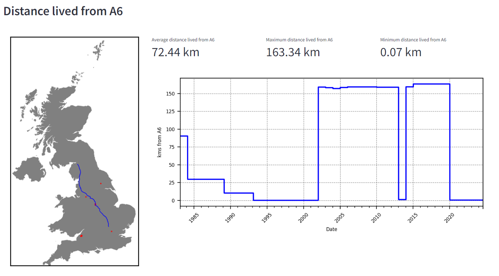

# RoadLife

## Why

Have you ever wondered how far on average you've lived from a specific road? How about if you've lived nearer to the M1 or A38? For some reason I have so I created a little app so you can check. It's called roadlife and can be found [here](https://roadlife.streamlit.app/)

## What

The app itself is pretty simple and relies on [Wikidata](https://www.wikidata.org/wiki/Wikidata:Main_Page) for information about the roads, [GeoPandas](https://geopandas.org/en/stable/index.html) for the analysis of the spatial data and [Streamlit](https://streamlit.io/) for the front end and hosting.

## Output

If you input your details and select the road you're interested in and click submit you get the following output:

|  |
| :--: |
| Example Output |

## Technical detail

If you're interested the following section goes into a bit of technical detail about how I got it all to work:

### Wikidata

Wikidata is a document-oriented database, which is a type of NoSQL database, that is used to store open source data for wikimedia projects. It is an amazing achievement and a really useful resource available to everyone for free. I was looking for a way to get the location and route of all the major roads in the UK and luckily this information is easily obtainable through wikidata.

All data in Wikidata is stored as a semantic triplet, i.e. a subject, a predicate and an object. In our case we first wanted to get all the various uk roads within wikidata that had route data available. This is done in the querying language SPARQL. They query I ran is below ([link](https://query.wikidata.org/#SELECT%20%3Froad%20%3FroadLabel%20%3FkmlTemplate%0AWHERE%20%7B%0A%20%20%3Froad%20wdt%3AP16%20wd%3AQ387692%3B%20%20%20%0A%20%20%20%20%20%20%20%20wdt%3AP3096%20%3FkmlTemplate.%20%20%23%20P3096%20is%20the%20property%20for%20KML%20files%0A%20%20%0A%20%20SERVICE%20wikibase%3Alabel%20%7B%20bd%3AserviceParam%20wikibase%3Alanguage%20%22%5BAUTO_LANGUAGE%5D%2Cen%22.%20%7D%0A%7D%0A))

```SPARQL
SELECT ?road ?roadLabel ?kmlTemplate
WHERE {
  ?road wdt:P16 wd:Q387692;   
        wdt:P3096 ?kmlTemplate.  # P3096 is the property for KML files
  
  SERVICE wikibase:label { bd:serviceParam wikibase:language "[AUTO_LANGUAGE],en". }
}

```

It is looking for all items that have:

* the property "Transport Network" that is assigned the value "Great Britain road number scheme"
* the property "KML File"

So we're trying to find all items that are part of the Great Britain road network that also have a KML file attached. KML files are an XML file that encodes geospatial information. I then used BeautifulSoup to extract and save the KML files.

### GeoPandas

Geopandas is an extension of the Pandas Library with specific tools to handle geospatial data. Once I had converted postcodes and dates to a geo dataframe of lat and long pairs and dates I could then find the minimum distance from each point to the road selected.

### Streamlit

I now had the ability to answer my questions but I thought there is probably someone else out there who has wondered the same. So I dveloped a front end to allow people to run their own analysis. I did this using Streamlit which is a brilliant framework that not only allows ML solutions to be quickly protoypled and rolled out, but also hosts apps for free on their community hub.  

Streamlit is really fun to use, simple to get going and can handle complex visualisation and analysis without leaving the python ecosystem. 

## Summary

While this might seem a pointless exercise I have really enjoyed solving this problem and I have learnt a lot about Streamlit and wikidata so it was defeinitely worthwhile. If you're interested in looking into the code it can be found [here](https://github.com/rodmonic/RoadLife).
